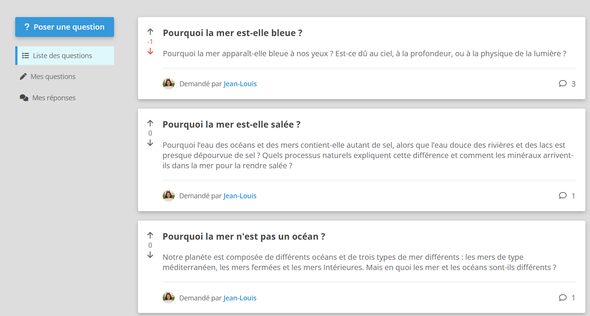
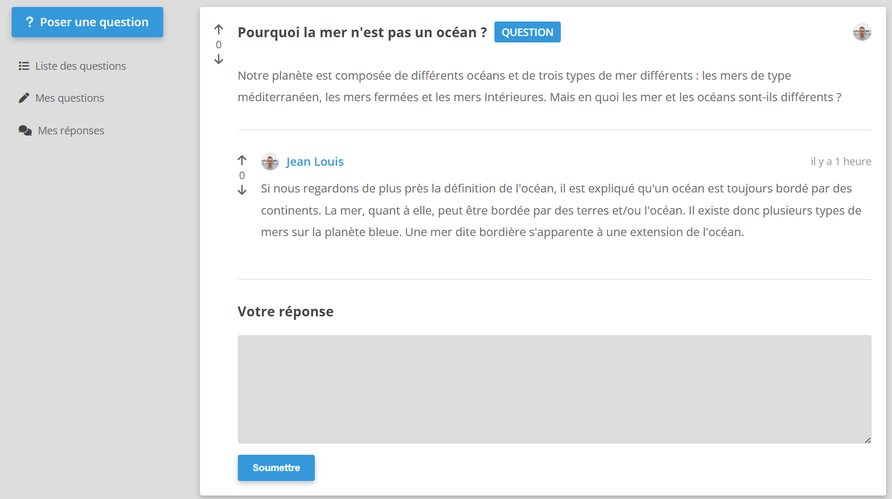

# 🧠 Wonder – Version 3

Bienvenue dans la version 2 de **Wonder**, un projet réalisé dans le cadre de ma formation Symfony sur [Dyma](https://dyma.fr).

Après avoir posé les bases visuelles (V1) puis intégré les formulaires (V2), place à la **persistance des données** !  
Cette version se concentre sur l’intégration de **Doctrine ORM** pour stocker et manipuler les données utilisateurs.

---

## 🎯 Objectifs de la V3

-   Mise en place de **Doctrine ORM** :
    -   ✅ Configuration de la connexion à la base de données
    -   ✅ Création des entités et mapping avec les tables
    -   ✅ Utilisation des migrations pour gérer l’évolution du schéma
-   Sauvegarde des données issues des formulaires en base
-   Lecture et affichage des données dans les templates Twig
-   Utilisation du **Repository Pattern** pour interagir avec les entités

---

## 🧰 Tech utilisées

-   Symfony 6.x
-   Doctrine ORM
-   Doctrine Migrations
-   Twig
-   Bootstrap 5 (via Webpack Encore)

---

## 📸 Aperçu

---

## 🗂️ Structure des fichiers (simplifiée)

src/

├── Entity/  
│ └── Question.php # Entité représentant une question

├── Repository/  
│ └── QuestionRepository.php # Gestion des requêtes liées à Question

templates/  
├── question/  
│ ├── index.html.twig # Liste des questions  
│ └── show.html.twig # Détails d’une question

---

## 🚀 Prochaine étape : Version 4

👉 Ajout de l’**authentification et sécurité** avec le Security Bundle de Symfony.  
Les utilisateurs pourront créer un compte et se connecter 🔐

---

## 👨‍💻 Auteur

Projet fil rouge développé par **Mathias**  
📚 Formation Symfony – [Dyma](https://dyma.fr)  
👉 En recherche active d’un poste en développement web (Symfony/PHP)  
📫 [Me contacter](mailto:renardmathias2@gmail.com)

---

## 📝 Licence

Projet sous licence MIT – à but pédagogique 😎
