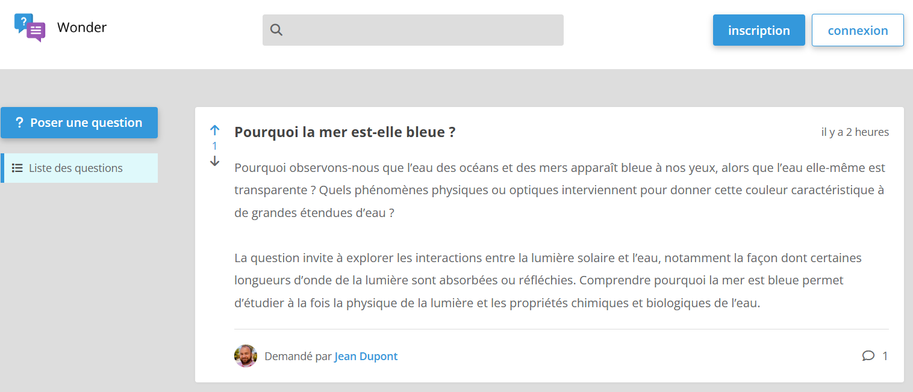
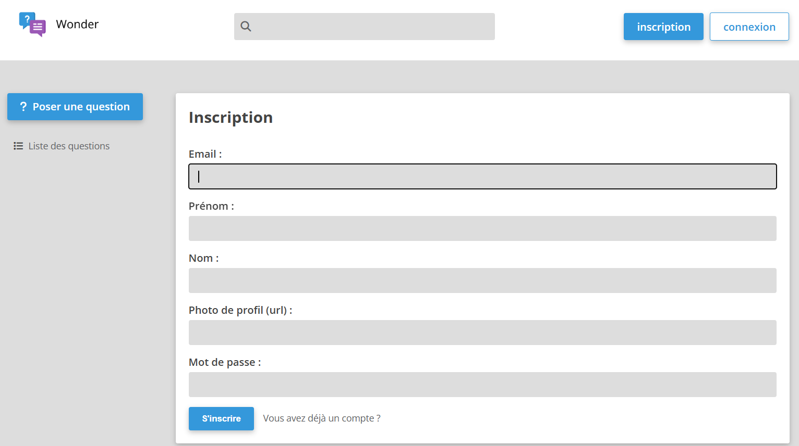
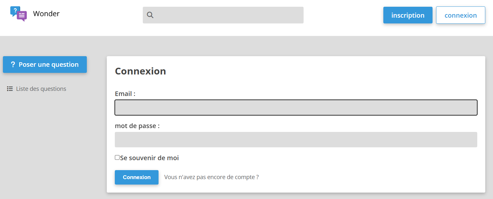
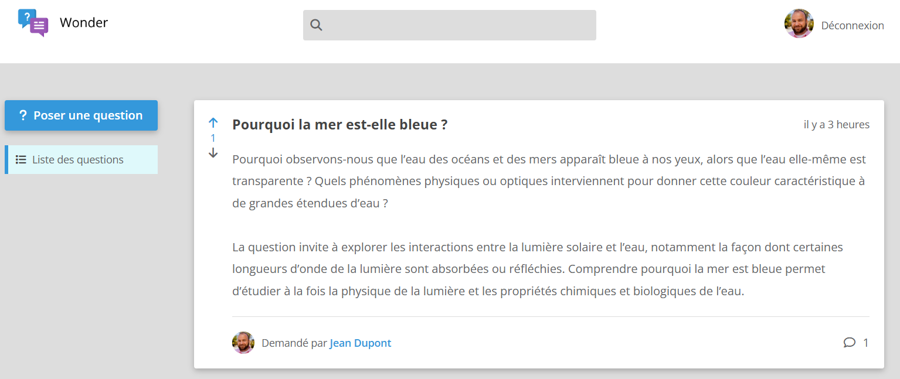
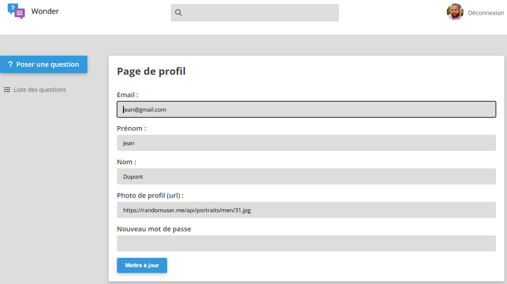

# 🧠 Wonder – Version 4

Bienvenue dans la version 4 de **Wonder**, un projet réalisé dans le cadre de ma formation Symfony sur [Dyma](https://dyma.fr).

Après avoir posé les **bases visuelles** (V1), intégré les **formulaires** (V2) et mis en place la **persistance des données** (V3), cette version se concentre sur l’authentification et la sécurité. Les utilisateurs peuvent maintenant créer un compte et se connecter de manière sécurisée 🔐.

---

## 🎯 Objectifs de la V4

-   Mise en place de **l’authentification Symfony** :
    -   ✅ Création de la gestion des utilisateurs (inscription / login / logout)
    -   ✅ Hashage sécurisé des mots de passe avec bcrypt / sodium
    -   ✅ Protection des routes et contrôle des accès avec le Security Bundle
-   Gestion des rôles utilisateurs (ROLE_USER, ROLE_ADMIN) pour sécuriser certaines pages
-   Intégration de formulaires sécurisés pour l’inscription et la connexion
-   Validation côté serveur et affichage des erreurs dans Twig
-   Mise en place d’une navigation adaptée selon l’état de connexion de l’utilisateur

---

## 🧰 Tech utilisées

-   Symfony 6.x
-   Twig
-   Security Bundle
-   Doctrine ORM (pour stocker les utilisateurs)
-   Bootstrap 5 (via Webpack Encore)

---

## 📸 Aperçu

---

## 🗂️ Structure des fichiers (simplifiée)

src/
├── Entity/
│ └── User.php # Entité représentant un utilisateur
├── Repository/
│ └── UserRepository.php # Gestion des requêtes liées aux utilisateurs
├── Security/
│ └── LoginFormAuthenticator.php # Authentificateur pour le formulaire de login
templates/
├── security/
│ ├── login.html.twig # Formulaire de connexion
│ └── register.html.twig # Formulaire d’inscription

---

## 🚀 Prochaine étape : Version 5

👉 Ajout de la **réinitialisation de mot de passe** avec **envoi d’email** via le composant **Mailer** de Symfony 📧.
Les utilisateurs pourront récupérer leur mot de passe en toute sécurité.

---

## 👨‍💻 Auteur

Projet fil rouge développé par **Mathias**  
📚 Formation Symfony – [Dyma](https://dyma.fr)  
👉 En recherche active d’un poste en développement web (Symfony/PHP)  
📫 [Me contacter](mailto:renardmathias2@gmail.com)

---

## 📝 Licence

Projet sous licence MIT – à but pédagogique 😎
